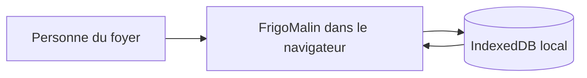

# ADR 0001 — Stockage navigateur

- **Statut :** proposé
- **Date :** 2026-10-02

## Contexte

[PRODUCT.md](../../PRODUCT.md) et [docs/mvp.md](../mvp.md) imposent le stockage local, utilisable hors ligne, sans backend ni compte. Les données Must couvrent au minimum l’inventaire — dont quantités, emplacements et DLC/DDM — et la liste de courses. Elles doivent survivre à un rechargement hors ligne dans le même navigateur.

## Options

### localStorage

**Avantages**
- API très simple, native au navigateur ; aucune dépendance.
- Suffisant pour un petit état sérialisé et un POC à faible volume.

**Inconvénients**
- Stocke des chaînes : il faut sérialiser et désérialiser les objets.
- Opérations synchrones, sans transactions ni index ; les mises à jour peuvent réécrire un état entier.
- Quotas et conservation dépendent du navigateur.

### IndexedDB

**Avantages**
- Stocke des objets structurés de manière asynchrone, avec transactions et index.
- Convient directement à plusieurs ensembles de données et à l’évolution de l’inventaire.
- Fonctionne avec le stockage local du navigateur, sans service distant.

**Inconvénients**
- API, transactions et gestion de versions plus complexes qu’avec `localStorage`.
- Il faut définir et maintenir un schéma de base de données, même pour le POC.

## Décision

Choisir **IndexedDB**, via l’API native du navigateur, sans ajouter de service de stockage distant. Les objets d’inventaire et les articles de courses restent sur l’appareil.

**Critère chiffré proposé :** les deux ensembles de données doivent être conservés lors de **10/10 cycles** d’écriture puis de rechargement hors ligne, dans le même navigateur. Ce seuil est un critère de validation, pas une mesure actuelle.

## Conséquences

- La persistance structurée et asynchrone correspond mieux aux données métier que des objets sérialisés dans une chaîne.
- Le POC doit gérer l’initialisation et les évolutions de schéma IndexedDB.
- Les données restent limitées au navigateur et à l’appareil : pas de partage ni de synchronisation.
- L’application doit gérer les échecs de stockage et ne pas annoncer une sauvegarde réussie si l’écriture échoue.
- **À vérifier :** besoins de sauvegarde ou d’export et comportement visé lorsque le stockage du navigateur est supprimé ou indisponible.

