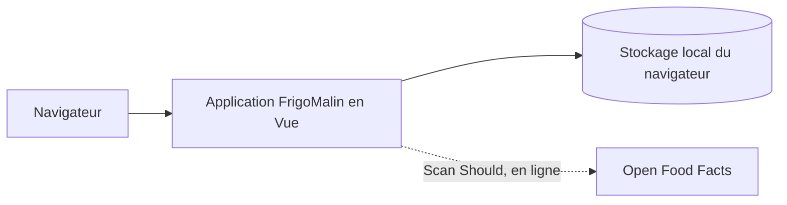

# ADR 0002 — Framework frontend

- **Statut :** proposé
- **Date :** 2026-10-02

## Contexte

Le POC doit fournir six fonctionnalités Must dans une PWA entièrement exécutée dans le navigateur. Le fonctionnement hors ligne et le stockage local sont requis ; aucun backend ni compte n’est prévu. Aucun manifeste ou code frontend existant n’a été trouvé : ce choix ne reprend donc pas un framework déjà adopté dans le dépôt.

## Options

### React

**Avantages**
- Écosystème et documentation très larges.
- Convient à une interface composée de vues et de composants.

**Inconvénients**
- Offre davantage de choix d’outils et de conventions à fixer pour un POC.
- Les modèles React et JSX ajoutent une courbe d’apprentissage si l’équipe ne les connaît pas.

### Vue

**Avantages**
- Modèle de composants et réactivité adaptés à une interface interactive de taille modeste.
- Compromis entre intégration rapide et écosystème disponible.
- Peut s’exécuter côté navigateur et s’intégrer à une PWA sans backend.

**Inconvénients**
- Nécessite d’adopter ses conventions et son modèle de réactivité.
- L’écosystème et la familiarité de l’équipe sont à confirmer.

### Svelte

**Avantages**
- Syntaxe de composants concise et compilation en code navigateur.
- Peut convenir à une interface légère.

**Inconvénients**
- Écosystème et ressources disponibles potentiellement moins étendus que ceux de React.
- La familiarité de l’équipe avec Svelte est inconnue.

### Comparaison chiffrée initiale

Évaluation heuristique sur **3 critères**, notés de 1 à 5 : simplicité pour le POC, maturité de l’écosystème et sobriété d’intégration. Ces scores ne sont pas des mesures de bundle ni des résultats de prototype.

| Framework | Simplicité POC | Écosystème | Sobriété d’intégration | Total /15 |
|---|---:|---:|---:|---:|
| React | 3 | 5 | 3 | 11 |
| Vue | 5 | 4 | 4 | 13 |
| Svelte | 4 | 3 | 5 | 12 |

## Décision

Choisir **Vue** pour le POC, en raison de son score de simplicité et de son équilibre avec l’écosystème. L’interface, les règles métier et la communication avec le stockage local restent côté navigateur. Le framework ne justifie pas l’ajout d’un backend.

**À vérifier :** valider les scores par un petit prototype couvrant une vue d’inventaire, la persistance hors ligne et une alerte DLC/DDM. Le choix doit aussi tenir compte de l’expérience réelle de l’équipe.

## Conséquences

- Les vues interactives peuvent être découpées en composants sans introduire de couche serveur.
- Le POC dépendra du modèle de composants et de réactivité de Vue.
- Un outil de build et une stratégie PWA restent nécessaires ; leur choix n’est pas décidé par cet ADR.
- Les scores étant des estimations, ils ne démontrent pas que Vue produira un bundle plus petit ou un développement plus rapide.

