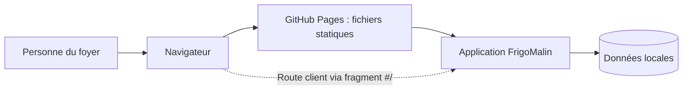

# ADR 0003 — Routage sur GitHub Pages

- **Statut :** proposé
- **Date :** 2026-10-02

## Contexte

Le POC est une application navigateur statique, sans backend. GitHub Pages sert des fichiers statiques ; il ne fournit pas de réécriture générale des routes vers `index.html`. Les documents produit n’établissent pas encore le nombre de vues ni les URL attendues.

## Options

### Hash routing

Les routes sont encodées dans le fragment URL, par exemple `/#/inventaire`.

**Avantages**
- Ne demande ni configuration de réécriture côté hébergeur ni backend.
- Le chemin transmis à GitHub Pages reste celui de la page d’application, ce qui convient à un hébergement statique.
- Permet de représenter une navigation partageable sous forme d’URL, sans synchroniser les données du foyer.

**Inconvénients**
- Les URL contiennent un fragment `#`, moins lisible qu’un chemin classique.
- Le fragment est également utilisé pour les ancres ; il faut éviter les conflits entre navigation et ancrage.
- Une migration vers des chemins propres changerait les URL enregistrées.

### Fallback `404.html`

Une page d’erreur personnalisée capture une route inconnue, préserve le chemin demandé et le transmet à l’application.

**Avantages**
- Permet des chemins plus lisibles, tels que `/inventaire`.
- Peut restaurer la route après un chargement direct si le mécanisme de fallback est correctement implémenté.

**Inconvénients**
- Nécessite un fichier `404.html` et une logique de restauration de route.
- Le chargement direct dépend du traitement d’une réponse 404 par le navigateur et par l’application.
- Le sous-chemin du dépôt GitHub Pages et le fonctionnement hors ligne compliquent la configuration.

### Comparaison chiffrée

Pour un routage client sur GitHub Pages, le hash routing nécessite **0 fichier de fallback** ; l’option `404.html` en nécessite **1**, avec une logique de redirection ou de restauration supplémentaire. Critère fonctionnel proposé : chaque route supportée doit réussir **2/2 vérifications**, ouverture directe et rechargement, sur l’URL GitHub Pages du projet.

## Décision

Choisir **hash routing** si le POC nécessite plusieurs vues navigables. Il évite de dépendre du traitement des 404 de GitHub Pages et respecte les contraintes statiques, navigateur et hors ligne. Aucun backend n’est requis.

**À vérifier :** si le POC reste une vue unique, un routeur pourrait être inutile ; confirmer également les vues et URL nécessaires avant de l’implémenter.

## Conséquences

- Les URL de navigation incluent un fragment ; c’est une concession de lisibilité en échange d’un déploiement statique plus simple.
- Les routes ne correspondent pas à des fichiers ou chemins servis par GitHub Pages.
- Le routage ne doit pas être confondu avec la synchronisation : les données restent locales à l’appareil.
- Les liens directs et rechargements doivent être testés sur le sous-chemin de déploiement réel ainsi qu’après chargement hors ligne.

